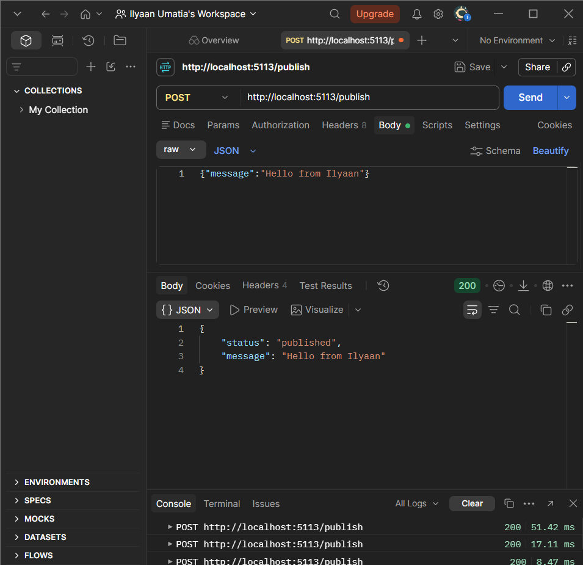
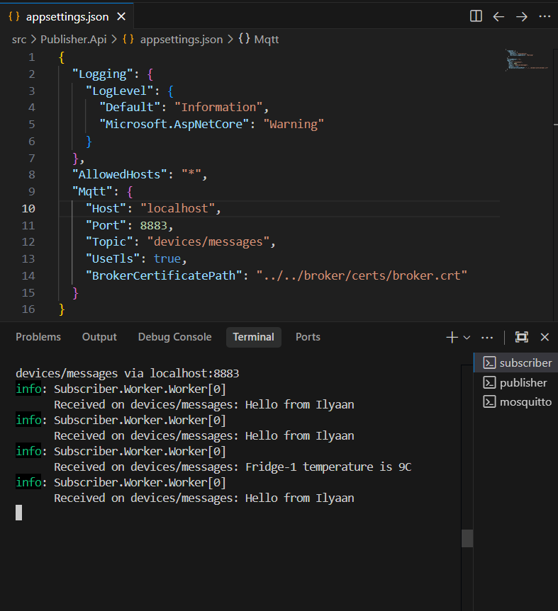
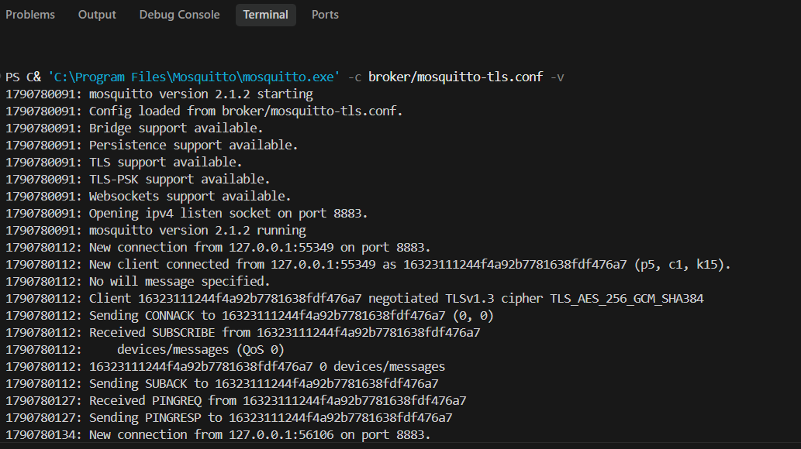
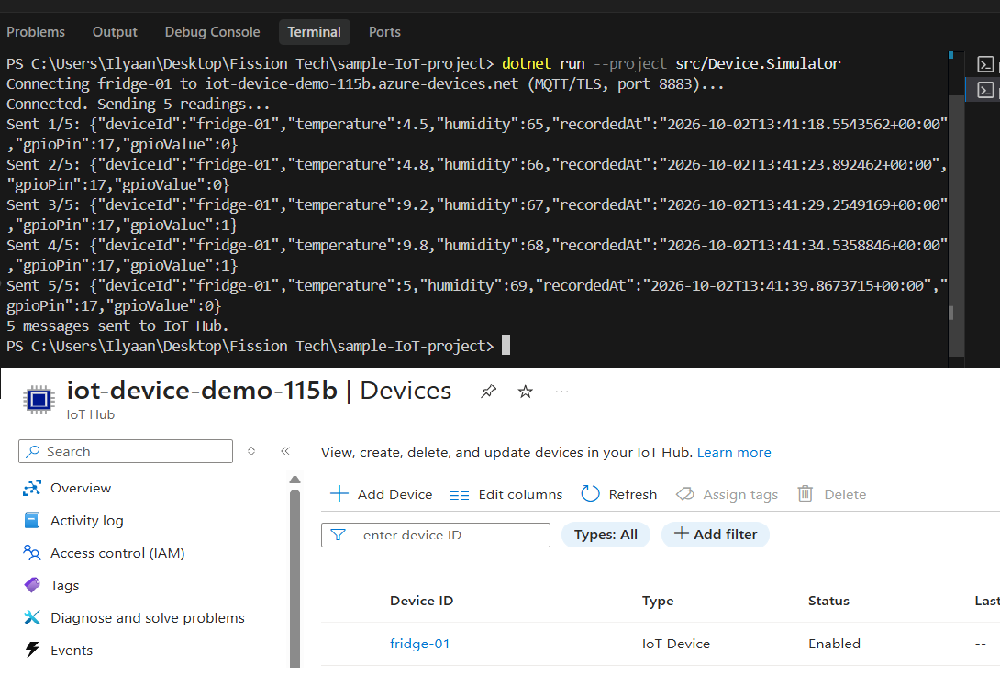
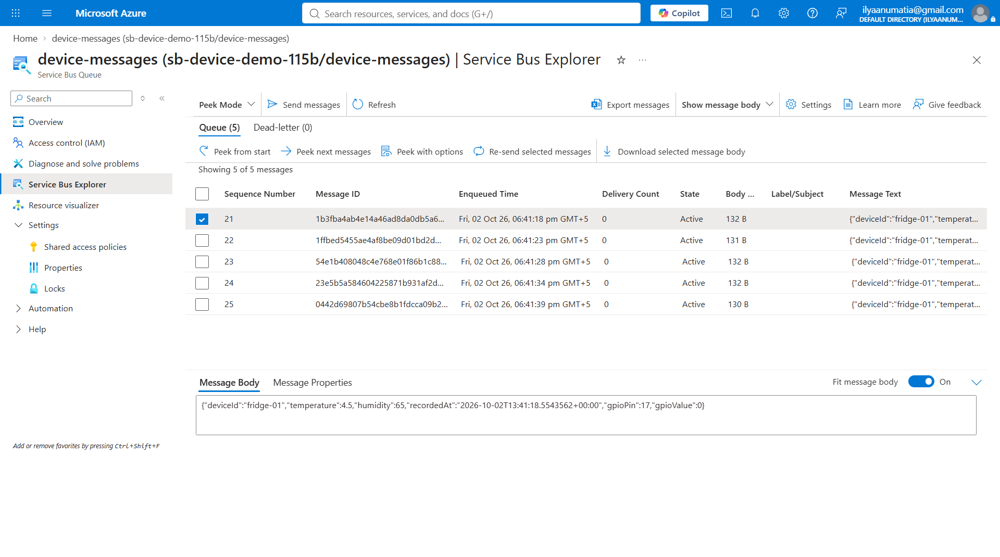
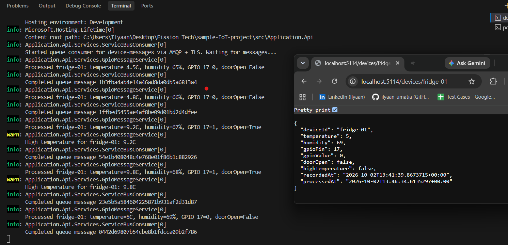

# .NET MQTT Demo

Two .NET examples: a local MQTT publisher/subscriber with Mosquitto, and a simulated device sending data through Azure IoT Hub and Service Bus to an application API.

**Local flow:** Postman → Publisher.Api → Mosquitto → Subscriber.Worker.

**Azure flow:** Device.Simulator → IoT Hub → Service Bus queue → GpioMessageService → Application.Api.

## Projects

| Project | Used in | Purpose |
|---|---|---|
| Publisher.Api | Local MQTT demo | Accepts device data through `POST /publish` and publishes it to Mosquitto. |
| Subscriber.Worker | Local MQTT demo | Subscribes to device topics and logs readings and temperature warnings. |
| Device.Simulator | Azure flow | Sends simulated fridge readings and GPIO input to IoT Hub over MQTT. |
| Application.Api | Azure flow | Consumes queue messages, processes them through GpioMessageService and exposes device status. |
| Mqtt.Common | Both | Shared settings and message models. |

## Requirements

- .NET 8 SDK or later
- For the local demo: Docker Desktop (Linux containers) or Mosquitto, and OpenSSL (included with Git for Windows)
- For the Azure flow: an Azure subscription, IoT Hub and a Service Bus queue

## 1. Local MQTT demo

Run these commands from the project root.

Generate the local certificate once:

```powershell
./scripts/New-LocalBrokerCertificate.ps1
```

Start the broker with Docker Desktop running:

```powershell
docker compose up -d
```

To view broker logs or stop it:

```powershell
docker compose logs -f mosquitto
docker compose down
```

The container uses `broker/mosquitto-docker.conf` and the local certificate files. The API and Worker still run with .NET on your computer.

Alternatively, start the locally installed broker. Run only one broker on port `8883` at a time:

```powershell
& 'C:\Program Files\Mosquitto\mosquitto.exe' -c broker/mosquitto-tls.conf -v
```

In a second terminal, start the subscriber:

```powershell
dotnet run --project src/Subscriber.Worker
```

In a third terminal, start the API:

```powershell
dotnet run --project src/Publisher.Api --launch-profile http
```

Broker settings are in each application's `appsettings.json`. The broker runs locally on port `8883`. Generated certificates and private keys are excluded from Git.

### Test with Postman

Send a `POST` request to `http://localhost:5113/publish` with **Body → raw → JSON**:

```json
{
  "deviceId": "fridge-01",
  "temperature": 9.2,
  "humidity": 65,
  "recordedAt": "2026-10-01T10:00:00Z"
}
```

The API returns `200 OK` with `status: published`. The Worker logs the readings and a high-temperature warning for this example. Temperature is in Celsius and humidity is a percentage.

Messages are published to `devices/{deviceId}/messages`. The Worker subscribes to `devices/+/messages` to receive readings from multiple devices. Try `fridge-02` with temperature `4.5` for a reading without a warning.

Invalid device IDs and humidity outside 0–100 return `400 Bad Request`. This local broker uses TLS and allows connections without client authentication.

### Local demo screenshots

These screenshots are from the initial version, which sent text messages on `devices/messages`. The current version above uses structured device payloads and a topic for each device.

Postman request and successful publish response:



The subscriber receiving the published messages:



The locally installed Mosquitto broker accepting a TLS connection and topic subscription:



## 2. Azure IoT flow

The simulator and application API run on your computer. IoT Hub and Service Bus run in Azure. The local Publisher.Api, Subscriber.Worker and Mosquitto container are not needed for this flow.

### Device simulator

Create an IoT Hub and register a device such as `fridge-01` with symmetric key authentication. Copy that device's primary connection string.

Paste the complete device connection string into `IoTHub:DeviceConnectionString` in `src/Device.Simulator/appsettings.Local.json`:

```json
{
  "IoTHub": {
    "DeviceConnectionString": "<your device's Primary connection string>"
  }
}
```

This local file is excluded from Git. After cloning the repository, create it by copying the simulator's `appsettings.json`. Leave the tracked file's connection string empty.

From the project root, run:

```powershell
dotnet run --project src/Device.Simulator
```

The simulator loads `appsettings.json` first, then overrides values with `appsettings.Local.json`. The local credential is stored as plain text on your computer; it is not encrypted. No prompt or script is needed on subsequent runs.

The simulator sends 5 readings, 5 seconds apart, then exits. It gets the device ID from the connection string. Simulated GPIO pin `17` reports `1` for door open and `0` for door closed. Two readings exceed 8°C. This mapping is a demo convention, not actual hardware access.

To preview the payloads without connecting to Azure:

```powershell
dotnet run --project src/Device.Simulator -- --preview
```

The Azure SDK handles authentication, TLS and IoT Hub's telemetry topic (`devices/{deviceId}/messages/events/`). This simulator connects directly to IoT Hub; Mosquitto is used by the original local demo.

The registered `fridge-01` device and the simulator sending all 5 readings:



Successful sending confirms IoT Hub accepted the messages. Configure a Service Bus queue endpoint and an enabled device telemetry route with query `true` in IoT Hub to forward new messages to the queue.

Service Bus Explorer showing the 5 routed messages and a reading's JSON payload before the backend consumes them:



### Application backend

On the `device-messages` queue, create a shared access policy named `application-reader` with **Listen** permission. Paste that policy's primary connection string into `ServiceBus:ConnectionString` in `src/Application.Api/appsettings.Local.json`. This is a Service Bus credential, separate from the simulator's IoT Hub device credential.

The local settings file is excluded from Git. After cloning, create it with:

```json
{
  "ServiceBus": {
    "ConnectionString": "<your queue's Listen policy connection string>"
  }
}
```

Start the backend from the project root:

```powershell
dotnet run --project src/Application.Api --launch-profile http
```

Run the simulator in another terminal. Open `http://localhost:5114/devices` or `http://localhost:5114/devices/fridge-01` to see the latest processed reading, door status and temperature flag. Before any reading arrives, the list is empty and the individual device endpoint returns 404.

The queue consumer uses AMQP with TLS on port `5671`. It completes messages after processing, removing them from the active queue. Invalid payloads go to the dead-letter queue. Without a local connection string, the API runs but the consumer is disabled and logs a configuration warning.

The backend processing the readings, logging high-temperature warnings and returning the latest device status:



Device status is kept in memory and resets when the backend restarts. Previously completed messages are not replayed; run the simulator again to populate fresh status. The latest reading's timestamp determines which status is kept, and high-temperature events are logged even if a later reading returns to normal.

Flow: simulated device → MQTT/TLS → IoT Hub → routing → Service Bus queue → GpioMessageService → application API.
