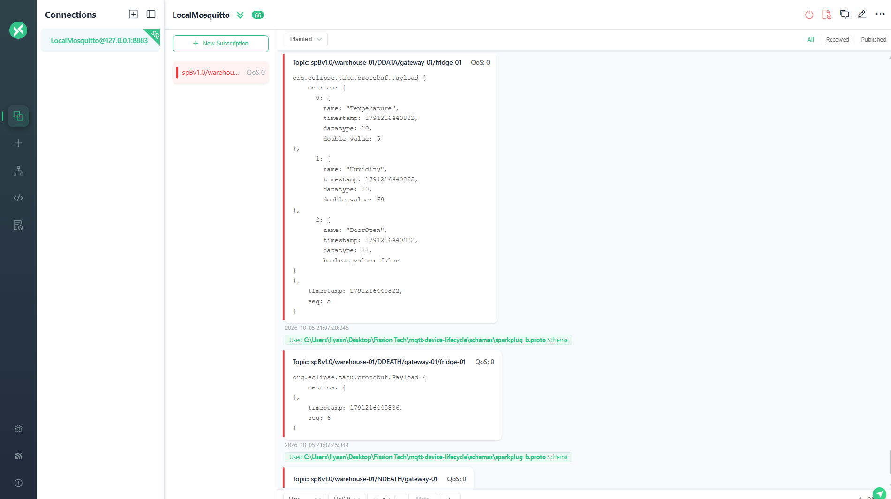
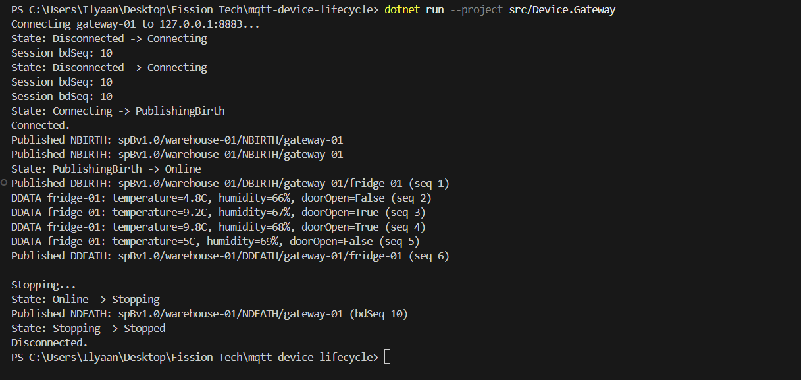
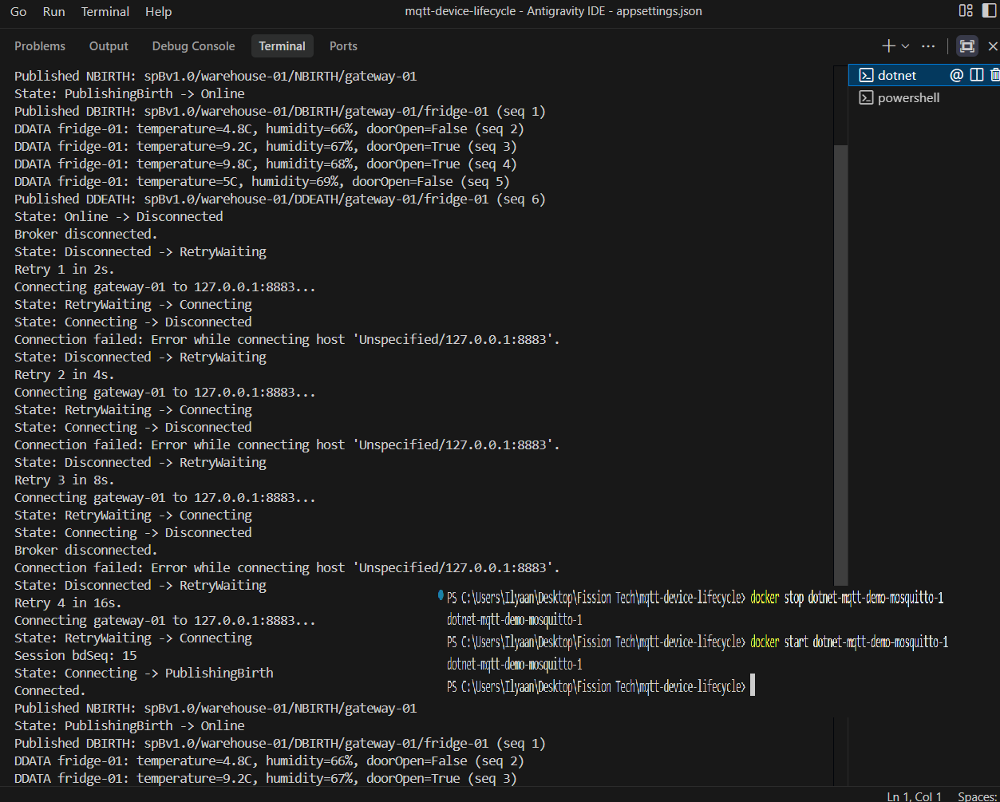

# MQTT Device Lifecycle

A .NET 8 gateway that simulates a fridge and publishes Sparkplug B lifecycle messages through a local Mosquitto broker. MQTTX is used to inspect the Protobuf payloads.

## Flow

Simulated fridge → Device.Gateway → Mosquitto → MQTTX.

The fridge reports temperature in Celsius, humidity as a percentage, and door status. The readings are fixed demo values: normal temperature, an open door with higher temperature, then recovery.

## Run

Requirements: .NET 8 SDK or later, Docker Desktop, MQTTX, and OpenSSL (included with Git for Windows).

Run these commands from the repository root, where `compose.yaml` and `scripts/` are located:

```powershell
./scripts/New-LocalBrokerCertificate.ps1
docker compose up -d
New-Item -ItemType Directory -Force mqtt-device-lifecycle/broker/certs | Out-Null
Copy-Item broker/certs/broker.crt mqtt-device-lifecycle/broker/certs/broker.crt
dotnet run --project mqtt-device-lifecycle/src/Device.Gateway
```

The gateway connects to `127.0.0.1:8883` with TLS. Broker, group, gateway and device settings are in `src/Device.Gateway/appsettings.json` inside this folder.

One initial device reading is sent in DBIRTH, followed by four DDATA updates, five seconds apart. After another five seconds, the fridge goes offline and DDEATH is sent. The gateway stays connected. Enter or Ctrl+C stops the gateway and publishes NDEATH.

On MQTT connection failure, the gateway retries after 2, 4, 8, 16 and then 30 seconds. It publishes birth messages again after reconnecting. If the gateway crashes, Mosquitto publishes its saved NDEATH Last Will.

## MQTTX

Create a connection with these settings:

| Setting | Value |
|---|---|
| Host | `mqtts://127.0.0.1` |
| Port | `8883` |
| Client ID | `mqttx_observer` |
| MQTT version | `3.1.1` |
| SSL/TLS | On |
| Certificate | CA or self-signed certificates |
| CA file | The generated `broker/certs/broker.crt` |
| Username / password | Empty |
| Auto reconnect | On |
| Subscription | `spBv1.0/warehouse-01/#` |

The MQTTX setup used for this demo has SSL Secure off because its certificate verifier rejected the local self-signed server certificate. TLS is still enabled; this setting skips server certificate verification in MQTTX. Use this setup with the local loopback broker. The .NET gateway verifies the broker certificate.

To decode messages, import `schemas/sparkplug_b.proto` into **Script → Schema → Protobuf** and save it. In the connection's **Run Script** dialog, select **Received**, the saved Protobuf schema, and Proto name `org.eclipse.tahu.protobuf.Payload`. Leave Function name empty.

Subscribe before starting the gateway. These messages are not retained.

## Topics

| Message | Topic | Purpose |
|---|---|---|
| NBIRTH | `spBv1.0/warehouse-01/NBIRTH/gateway-01` | Gateway online |
| DBIRTH | `spBv1.0/warehouse-01/DBIRTH/gateway-01/fridge-01` | Device online and initial readings |
| DDATA | `spBv1.0/warehouse-01/DDATA/gateway-01/fridge-01` | Updated readings |
| DDEATH | `spBv1.0/warehouse-01/DDEATH/gateway-01/fridge-01` | Device offline |
| NDEATH | `spBv1.0/warehouse-01/NDEATH/gateway-01` | Gateway offline |

`seq` tracks message order and starts at 0 for NBIRTH. `bdSeq` matches a gateway's birth and death messages. The session counter is saved locally, increments for each connection attempt and wraps from 255 to 0. Generated certificates and counter files are excluded from Git.

This demo covers the five message types above. Sparkplug command handling is not implemented.

## Code

```text
src/Device.Gateway/
├── Configuration/   Broker, Sparkplug and device settings
├── Connection/      MQTT connection, state machine and retry loop
├── Simulation/      Fixed fridge readings and device lifecycle
├── Sparkplug/       Topics, payloads and session counter storage
├── Program.cs
└── appsettings.json
schemas/             Official Protobuf schema and source attribution
```

## Demo

MQTTX showing decoded fridge readings and the device offline message:



Gateway and device lifecycle logs:



Stopping and restarting the broker to test automatic reconnect:

```powershell
docker stop dotnet-mqtt-demo-mosquitto-1
docker start dotnet-mqtt-demo-mosquitto-1
```


